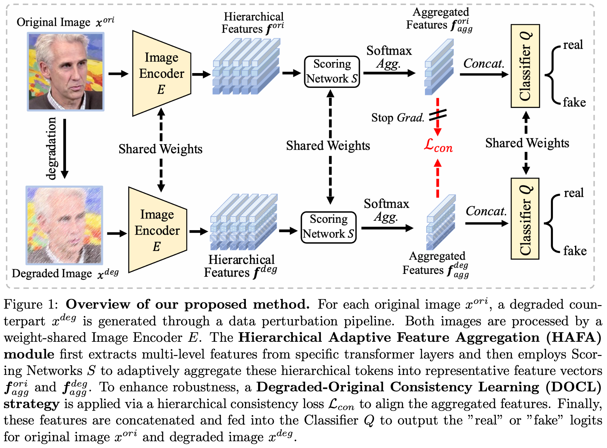

<div align="center">
  <h2><b> Hierarchical Adaptive Feature Aggregation with Degraded-Original Consistency Learning for Robust Deepfake Detection </b></h2>
</div>

<div align="center">

</div>

## Overview
This repository contains the implementation of our team's (HIT-VIRLAB) solution for [NTIRE 2026 - Robust Deepfake Detection Callenge @ CVPR 2026](https://www.codabench.org/competitions/12795/#/pages-tab): Hierarchical Adaptive Feature Aggregation with Degraded-Original Consistency Learning for Robust Deepfake Detection. Our method ranked 7th out of 337 participants in the final test phase, and has been officially included in the NTIRE2026 - Robust Deepfake Detection Challenge Report at the CVPR 2026 Workshop.



## Methodology

The description of our methodology is available [here](./assets/description.pdf).

## Repository Structure
```text
HAFA-DOCL/
│
├── inference.py          # inference script
├── scripts/              # training script
├── src/                  # source code
├── weights/              # put the model weights here
├── requirements.txt      # Python dependencies
└── README.md             # this file
```

## Open Weights

The model is trained on a hybrid deepfake image dataset containing over one million images. The model weights are provided [here](https://huggingface.co/JielunPeng/HAFA-DOCL).


## Requirements

### 1. Create a conda environment and activate it

```bash
conda create -n HAFA-DOCL python=3.10
conda activate HAFA-DOCL
```
### 2. Install Python ependencies

```bash
pip install -r requirements.txt
```

## Inference

To run inference on a folder containing test images:

```bash
python inference.py \
--data_root /path/to/test_images_root \
--weights_path /path/to/weights_path 
```
**Input Format**

The input directory should contain the test images:

```text
test_images/
├── img1.jpg/png
├── img2.jpg/png
├── img3.jpg/png
...
```

All images in the folder will be processed sequentially according to the alphabetical order.

**Output Format**

A file named "submission.txt" will be output, which contains one floating-point number per line, representing the probability (0.0 to 1.0) that the corresponding image is a Deepfake. The order of the lines match the alphabetical order of the image filenames in the provided dataset.


## Training

For the brave ones who want to train the model, please first prepare the data as described below:

We collect data from multiple publicly available deepfake datasets, including [FF++](https://github.com/ondyari/FaceForensics), [DFDC](https://www.kaggle.com/c/deepfake-detection-challenge/data), [DFFD](https://cvlab.cse.msu.edu/dffd-dataset.html), [FakeAVCeleb](https://github.com/DASH-Lab/FakeAVCeleb), [Celeb-DF++](https://github.com/OUC-VAS/Celeb-DF-PP), [DF40](https://github.com/YZY-stack/DF40), and [DDL](https://arxiv.org/abs/2506.23292). These datasets contain diverse forgery generation methods and visual conditions, providing rich variations for training robust deepfake detectors. 

For datasets provided as images, we directly use the images for training. For video-based datasets, we uniformly sample frames from videos to obtain image data. After data collection, we construct a million-scale hybrid deepfake image dataset consisting of both real and manipulated samples.

Then execute the training script:

```bash
cd scripts
bash finetune.sh
```

## Contact

If you have any questions regarding the implementation, please contact:

**Jielun Peng** 

Email: (jielunpeng_hit@163.com) or (jielunpeng.hit@gmail.com)

HIT-VIRLAB, Harbin Institute of Technology

---


